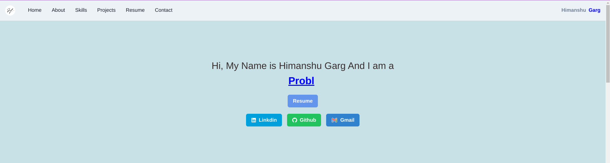
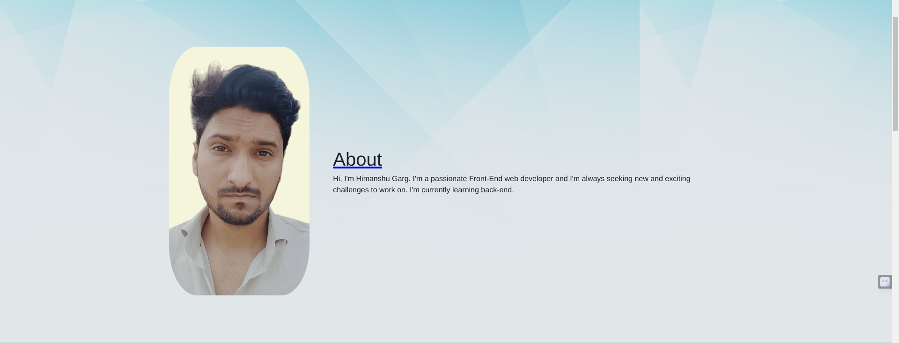
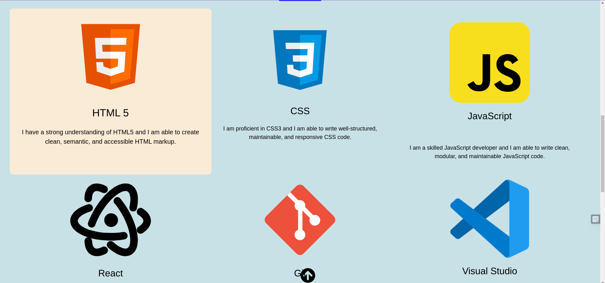
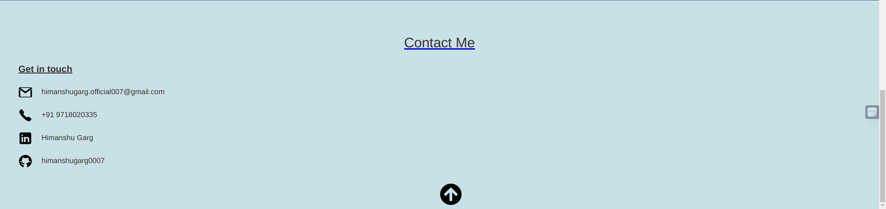

# My Portfolio

A brief description of what this project does and who it's for My Portfolio project
My web page has five sections which is navigated by navbar.


## Screenshots







## Installation

Install my-project with npm

```bash
  cd my-project
  npm install
  
```
    
## Deployment

To deploy this project run

```bash
  npm run dev
```


## 🚀 About Me
I'm Himanshu Garg. I'm a passionate Front-End web developer and I'm always seeking new and exciting challenges to work on. I'm currently learning back-end...


## Author

- [@himanshugarg0007](https://www.github.com/himanshugarg0007)


## 🛠 Skills
Javascript, HTML, CSS, React.js...


## Features

- compatable with differant screen size.
- Live previews
- Fullscreen mode
- Cross platform
- on click call and email Feature
